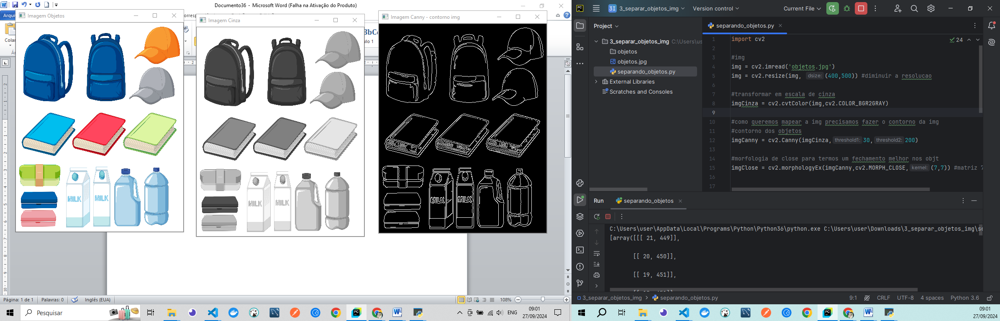
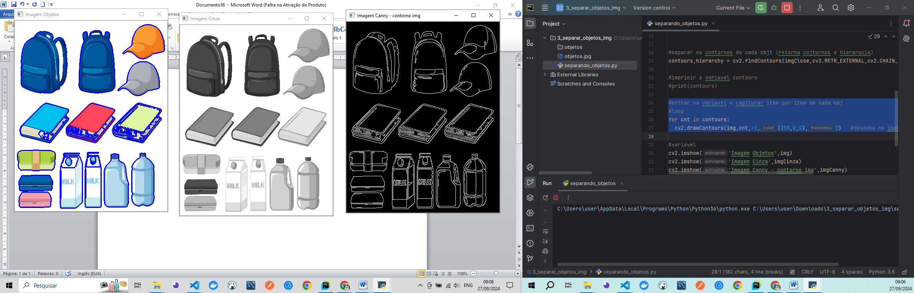
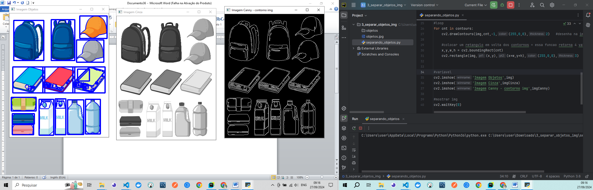
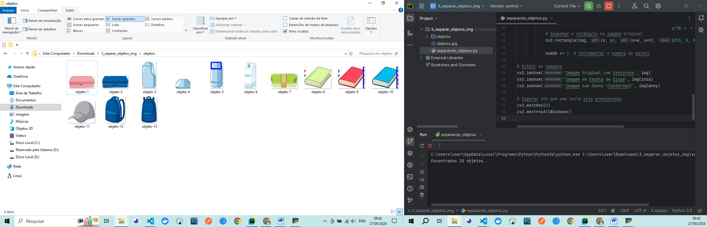
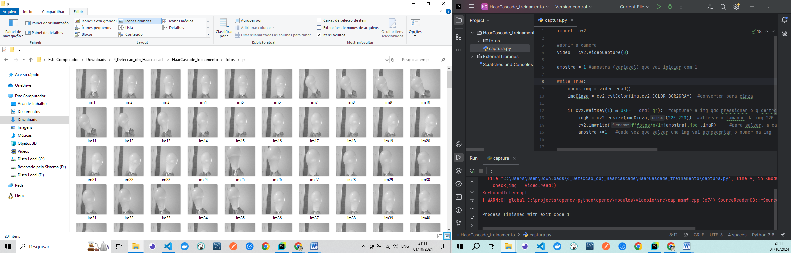
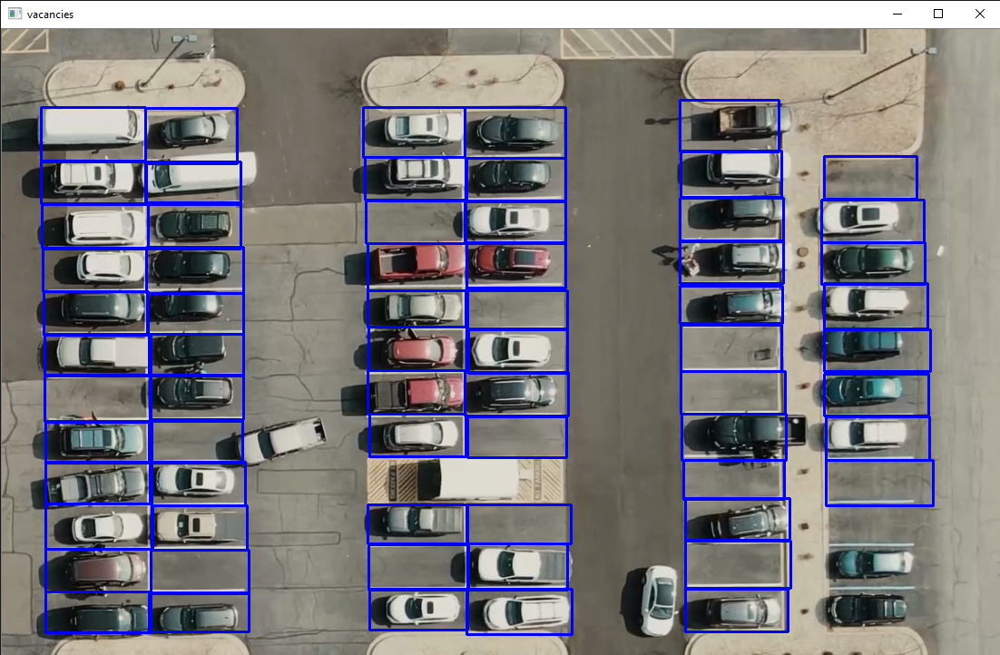
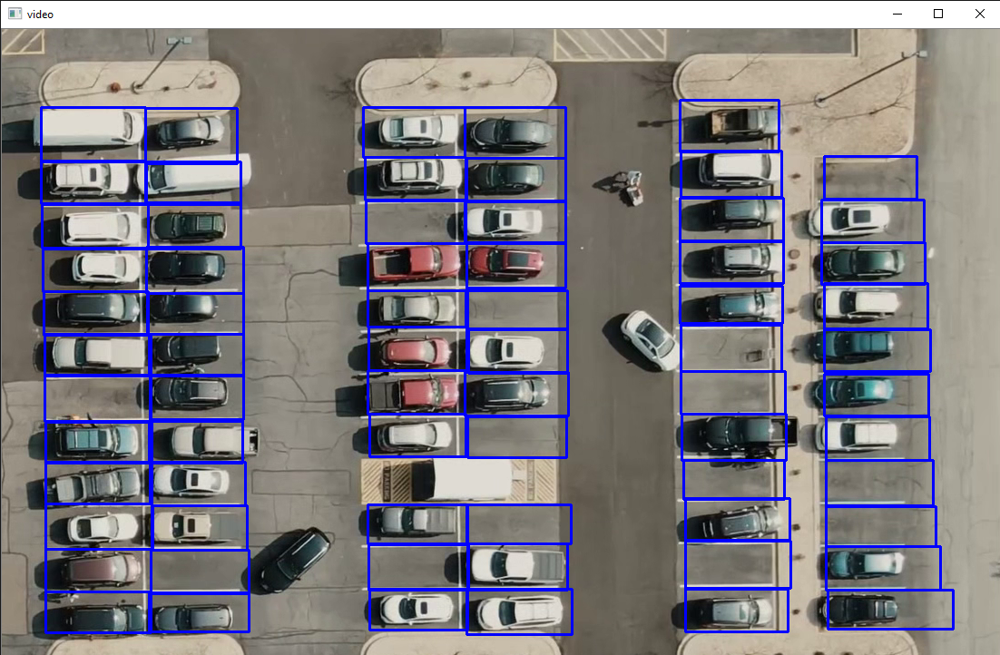
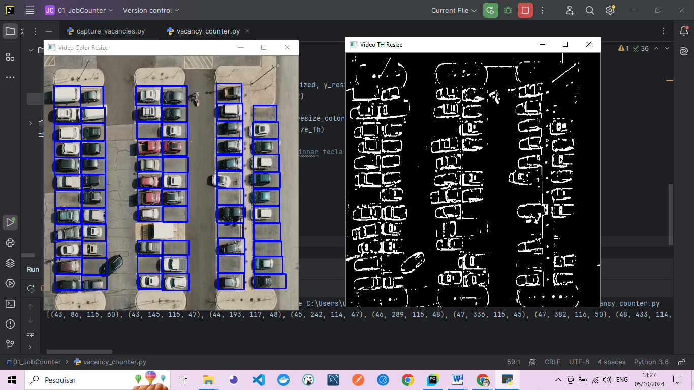
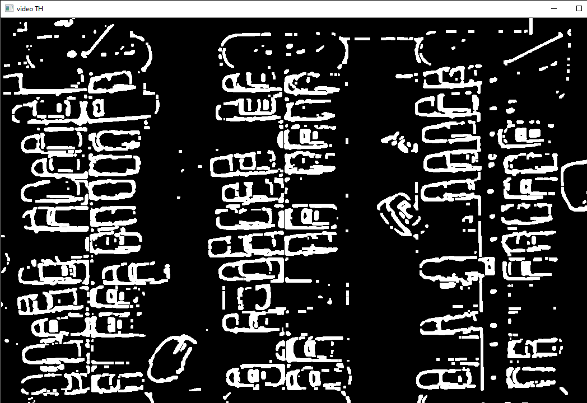
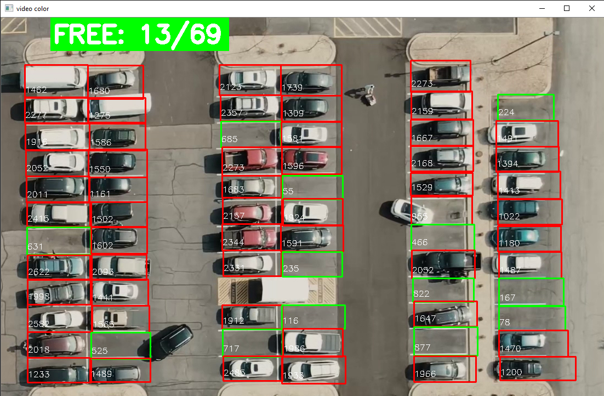

<h2 align="center"> 💻 Computer_Vision_Real_Projects_Opencv_Python </h2>
 
<h4 align="center">  - This repository explores Computer Vision in a practical way using OpenCV and Python. You will learn how to apply advanced image and video processing techniques to develop automated solutions, including object recognition, face detection, motion analysis, and more, integrating computer vision into real-world applications. </h4>
  
  ---

<h4 align="center">Projects: 🚀</h4>
---

<h4 align="center">1_opencvBasic 🚀</h4>

    
    

---

<h4 align="center">2_binarizacao _threshold_adaptativo 🚀</h4>

    
    

---
<h4 align="center">3_separate_objects_img 🚀</h4>

    
    
`  
   
    
    

---

<h4 align="center">4_Deteccao_obj_Haarcascade 🚀</h4>

    
     
`  
   
    
    

---

<h4 align="center">5_Parking_Vacancies_Accountant 🚀</h4>

    
     
`  
   
    
    
    
   
    
    

---

### 📋 Technologies Used

- OpenCV:** omputer Vision Library.
- Python:** Programming Language.
- PyCharm:** IDE for Python development.
- GitHub:** Version control and code collaboration.

---

### 🛠️ Key OpenCV Commands
 

<h4 align="center"> 1. Basic Image Manipulation </h4>
 

- imread: Loads an image.
- resize: Resizes the image.
- cvtColor: Converts between different color spaces (e.g., BGR to grayscale).
- GaussianBlur: Applies a filter to smooth the image.
- Canny: Detects edges.

-  

<h4 align="center"> 2. Morphological Operations </h4>
 

- dilate: Expands white areas, useful for highlighting objects.
- erode: Reduces noise by shrinking white areas.
- MORPH_OPEN: Erosion followed by dilation, removing small noise.
- GaussianBlur: Applies a filter to smooth the image.
- MORPH_CLOSE: Dilation followed by erosion, filling in gaps.

---

### 🚀 Features

 - Register goal: Allows the user to enter a new goal.
 - List goals: Displays all registered goals and allows you to select which ones have been completed.
 - Completed goals: Displays only the goals that have been marked as completed.
 - Open goals: Lists the goals that have not yet been completed.
 - Delete goals: Allows you to delete goals selected by the user.
 - Save data: All goals are saved in a JSON file (goals.json).

---

### 📦 Pre-requisites

 - Node.js: Make sure you have Node.js installed on your machine.
 - NPM packages: The project uses the @inquirer/prompts and fs libraries for prompts and file manipulation.

---

### 📦 Project structure

 - Application's #Back-end with Node.js, you will learn to explore technologies such as Fastify, Zod, Docker Compose, Drizzle ORM and create the database schema and seed, as well as create some of the project's features: goals, pending goals and complete goals. 
 - The #Front-end of the project. Let's start by building the interfaces, creating various components, and then using tools such as Vite, Biome and TailwindCSS!  
 - Application with #API using React Query and form with React Hook Form 

---

# 🎨 Layout
You can view the project layout via the link below:
- [Layout Web](https://www.figma.com/design/OB4CuFIpikW8L0eUUGyMeJ/NLW-Pocket-JS-%E2%80%A2-in.orbit-(Community)?node-id=82-2&node-type=canvas&t=ZvhfxeRBENvJSQqV-0) (Remember that you need to have a Figma account🥰).

### 🔗 Useful links
- **Project Repository:** [https://github.com/ludiemert/Nlw_Pocket_Node_React.git](https://github.com/ludiemert/Nlw_Pocket_Node_React.git)
#### ✒️ Authors
- **Rocketseat**

- #### My LinkedIn - 

#### Contact

#### [**Luciana Diemert**](https://github.com/ludiemert)

🛠 Full-Stack Developer  
📍 São Jose dos Campos – SP - Brazil

&nbsp;
&nbsp;
&nbsp;
&nbsp;

 

------------------
## 🎁 Acknowledgements and dedications

* Thank you #Rocketseat team

